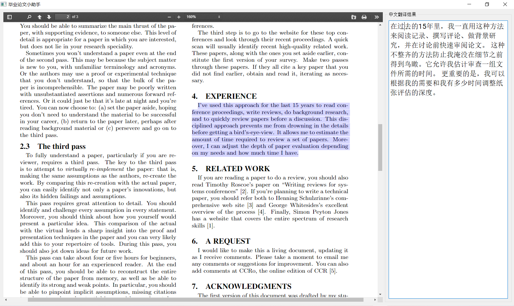

# thesis-helper
毕业论文小助手：一个翻译英文并将中文结果显示在侧边的PDF阅读器  
2019.11.4下午，看英文论文，总是要在pdf阅读器和谷歌翻译之间来回折腾，好麻烦，想着能不能一个窗口解决问题，就有了下面这个程序。

### 效果图如下：

### 使用技术
1. PyQt5
2. pdfjs

### 如何获取直接可以运行的程序
1. 下载[压缩包](https://github.com/muhualing/thesis-helper/releases/download/v1.0/thesis-helper.zip)
2. 解压缩
3. 运行thesis-helper.exe
4. 把pdf拖拽进来
5. 选中要翻译的文本，右键复制，然后侧边栏就有中文翻译结果了

### 源代码使用说明
1. 把这个库里面的东西全下载到本地，然后再把目录下面的pdfjs-2.2.228-dist.zip解压一下
2. 命令行中运行`pip install -r requirements.txt`
3. 命令行中运行`python main.py`就启动了
